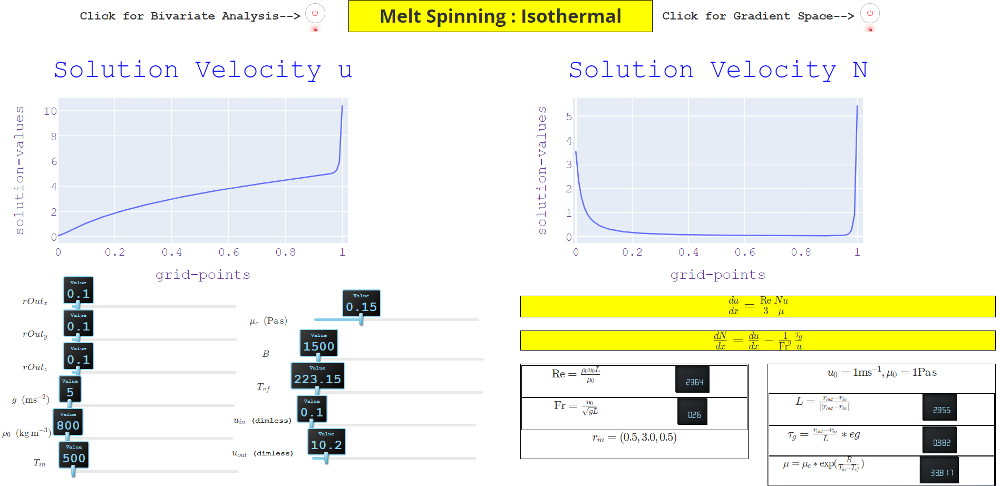

# Visualization for Isothermal Melt Spinning
This repository contains the essential files and instructions needed to construct a visual analysis tool aimed at optimizing the isothermal melt spinning process. Utilizing a trained machine learning model, this tool offers interactive predictions. The comprehensive process of constructing the machine learning model is outlined in the accompanying paper [[1]](#1).

## Deployment
The following steps will enable you to build and run the tool on your local machine.

1. Clone the repository.
2. Create a Conda virtual environment.
3. Install the necessary packages listed in the requirements.txt file.
4. Execute the 'python app.py' script.
5. Copy the localhost IP address (typically something like "http://127.0.0.1:8050/") and paste it into your web browser, preferably Chrome.

## References
<a id="1">[1]</a>
V.S. Victor, M. Ettmüller, A. Schmeißer, H. Leitte, S. Gramsch. 2024. Informed Machine
Learning for Optimizing Melt Spinning Processes. Submitted to IEEE Conference on
Artificial Intelligence.

